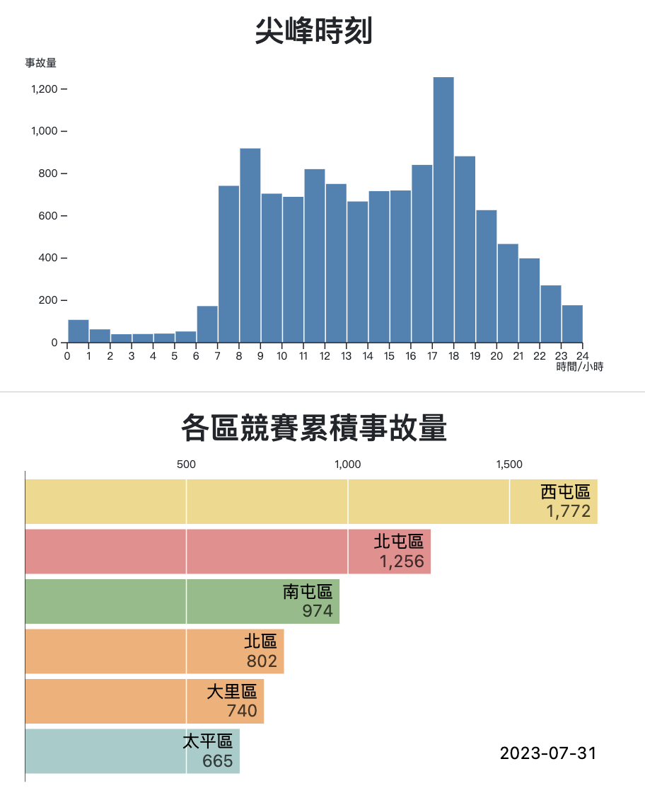
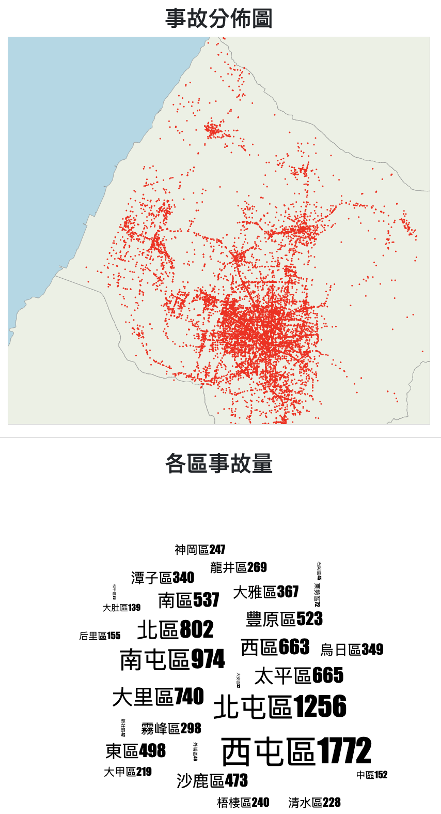

# 臺中市政府警察局112年7月份交通事故資料 數據分析

這是一個整合Flash與Vue3的SPA數據分析專案





# build backend

```sh
cd server
python3 -m venv env
source env/bin/activate

pip install -r requirements.txt
flask run --port=5001 --debug
```


# build frontend

```sh
cd client
npm install
npm run dev
```

# deploy

```sh
docker-compose -f docker-compose.spa.yml build
docker-compose -f docker-compose.spa.yml up
```